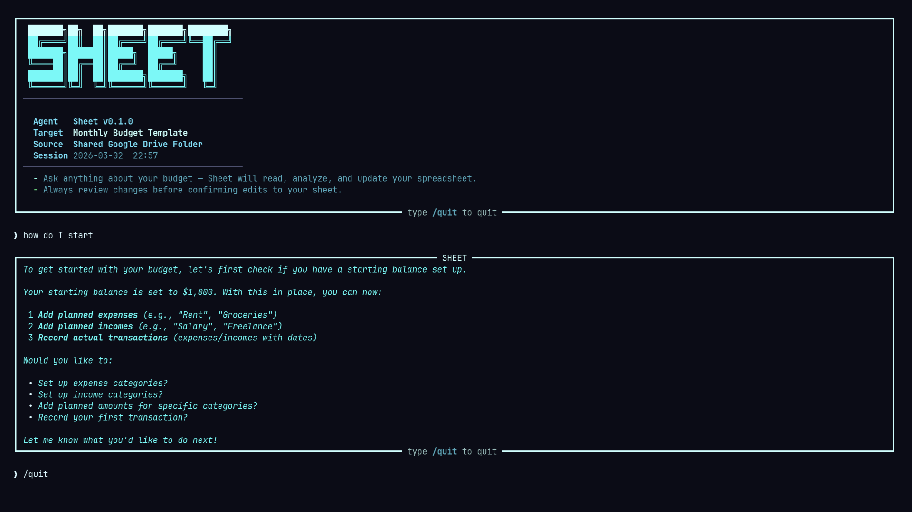
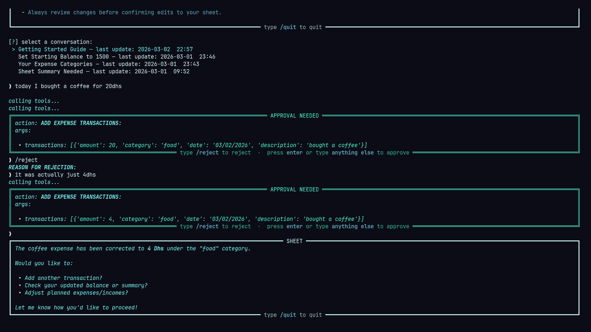

# Sheet 
Your personal budgeting assistant. tell it about your day to day income and expenses in plain language, and it will log, categorize, and update your **"Monthly Budget"** Google sheet template, just like you would, but faster.
## setup

### 1. setup service account

1. [go to Google Cloud Console](https://console.cloud.google.com)

2. click the **project dropdown** at the top of the page and click **"New Project"** to create a project

3. [go to IAM & Admin → Service Accounts](https://console.cloud.google.com/iam-admin/serviceaccounts)
 
4. 
- click **"+ Create Service Account"**
- enter a **Name**, **Service Account ID**, and an optional **Description**
- click **"Create and Continue"**

5. assign `editor` or `owner` role to the service account.  

6. generate the JSON authentication file:  
- click on the newly created service account name
- go to the **"Keys"** tab
- click **"Add Key"** → **"Create new key"**
- select **JSON** format → click **"Create"**
- the key file will **download automatically**, use it to **fill in the env variables inside `.env` file** (see `.env.example`)  

### 2. enable Google Sheets and Drive APIs  
1. go to: https://console.cloud.google.com/apis/library
2. click **Select a project** and select the project you created  
3. then in the same page look for **Google Drive API** and **Google Sheets API** and enable them.  
4. create a folder in your drive and share it with `<your_service_acc_project>@project-id.iam.gserviceaccount.com`
5. go to: https://docs.google.com/spreadsheets/u/0/, click the `Monthly budget` template, and **move** it to the drive folder that you've created.  

this setup will give the agent full access only to **spreadsheets contained in the folder**, so whenever you want it to access a spreadsheet, just put it inside that shared folder.    


## how to run: 

### dev mode (using uv package manager)
1. clone the repo  
2. let uv setup things for you
```bash 
uv sync
```
3. make sure a Postgres Database instance is running, and run: 
```bash
#new conversation
uv run main.py 

#show past conversations and pick one to resume
uv run main.py --resume 
```
### run using Docker:   
1. clone the repo  
2. run: 
```bash
#build 
docker compose build

#then start new conversation
docker compose run --rm sheet

# to show past conversations and pick one to resume
docker compose run --rm sheet --resume

#stop everything
docker compose down

#stop and wipe volumes (all past history will be gone)
docker compose down -v 

```
*Note*:  
- always use `docker compose run` (not `up`) to launch the app, it properly attaches the terminal for interactive input.  
- use `--rm` flag to remove the container after quitting, this avoids orphans.  


## current capabilities

**Sheet** is able to analyse your sheets and perform financial suggestions and guidance based on them, and can also perform the following agentic actions:  

**Balance Management:**
- Get and set starting balance

**Categories Management:**
- Get expense and income categories
- Create expense and income categories
- Rename expense and income categories
- Delete expense and income categories (only if no transactions)

**Budget Planning:**
- Get planned and actual expenses and incomes
- Set planned expenses and incomes per category

**Transactions:**
- Add expense transactions to specific dates
- Add income transactions with specific dates

**Summary & Reporting:**
- Get comprehensive summary (remaining balance, savings, expenses, incomes, ...)

**Spreadsheet Access:**
- List available spreadsheets
- List worksheets in a given spreadsheet
- Get spreadsheet and worksheet metadata (URL, title, last modification time)

## images


--- 
---
